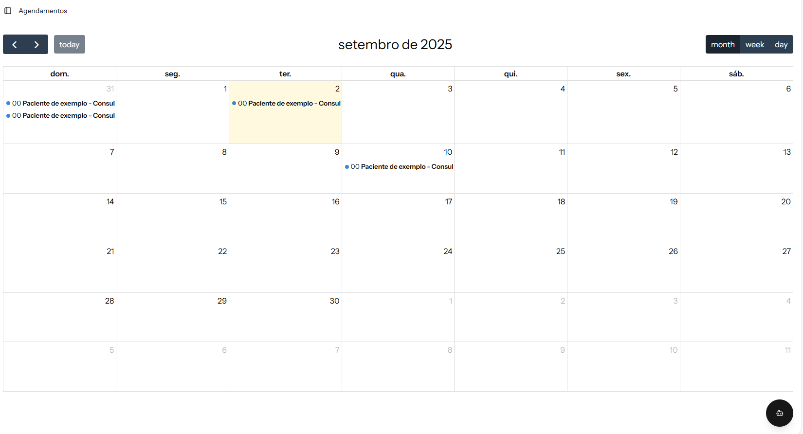
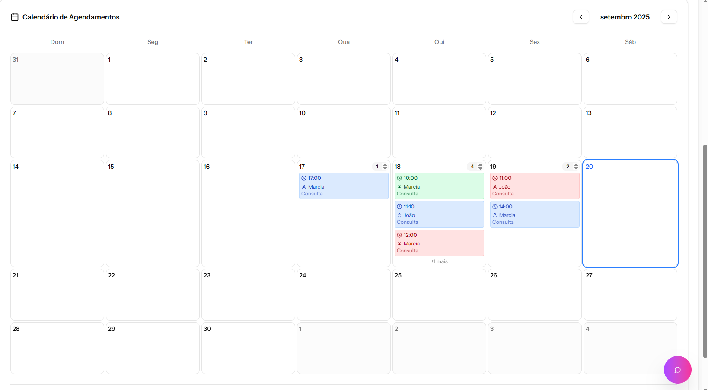
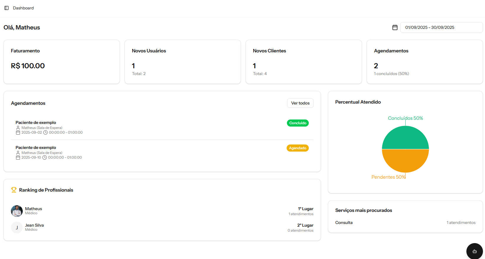
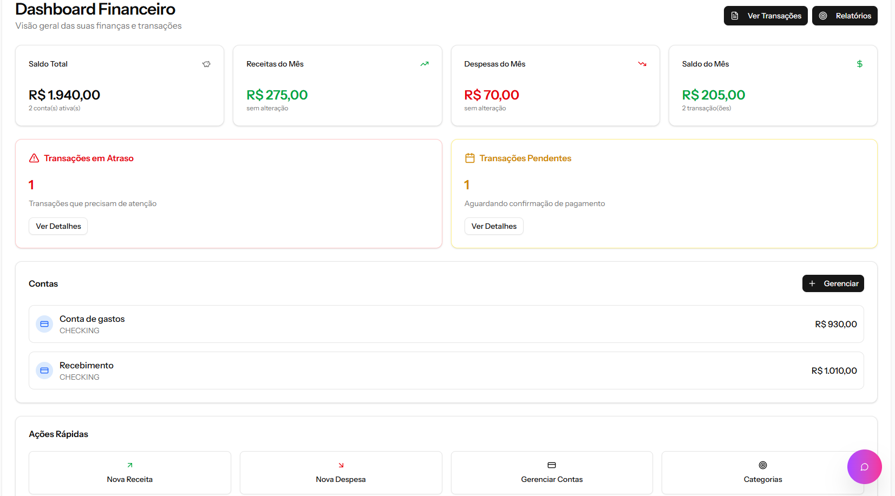
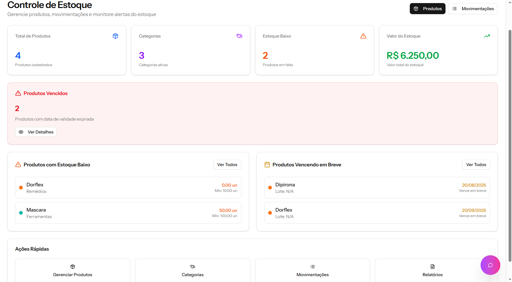
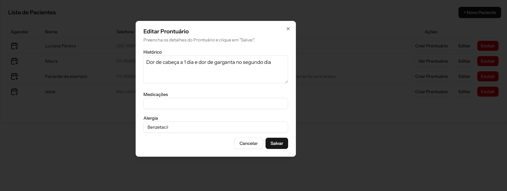
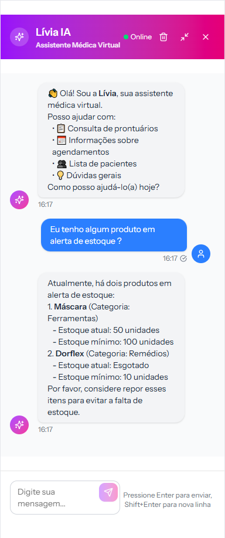

<div align="center">

# 🏥 ManagerClin

### Sistema Completo de Gestão para Clínicas Médicas

[](https://laravel.com)
[](https://react.dev)
[](https://www.typescriptlang.org)
[](https://inertiajs.com)
[](https://tailwindcss.com)

**Sistema moderno e completo para gestão de clínicas médicas com agendamento inteligente, prontuários digitais, controle financeiro e muito mais.**

[🚀 Instalação](INSTALLATION.md) • [🐛 Reportar Bug](https://github.com/yourusername/managerclin/issues)

</div>

---

## ✨ Principais Funcionalidades

### 📅 **Agendamento Inteligente**
Sistema completo de agendamento com calendário interativo, gestão de salas, serviços e profissionais.





---

### 📊 **Dashboards Poderosos**

#### Dashboard Principal
Visão geral completa da clínica com métricas em tempo real.



#### Dashboard Financeiro
Controle total das finanças da clínica.



#### Dashboard de Estoque
Gestão inteligente de estoque e materiais.



---

### 📋 **Prontuários Digitais**
Sistema completo de prontuário eletrônico com histórico, anexos e geração de atestados.



---

### 🤖 **Assistente IA Integrado**
Chatbot inteligente para auxiliar nas tarefas do dia a dia.

<div align="center">
  
  
</div>

---

## 🎯 Recursos Principais

<table>
<tr>
<td width="50%">

### 🏥 Gestão Clínica
- ✅ Agendamento de consultas
- ✅ Gestão de pacientes
- ✅ Prontuários eletrônicos
- ✅ Atestados médicos com QR Code
- ✅ Controle de salas e equipamentos
- ✅ Gestão de serviços e procedimentos

</td>
<td width="50%">

### 💼 Gestão Administrativa
- ✅ Dashboard com métricas em tempo real
- ✅ Controle financeiro completo
- ✅ Gestão de estoque
- ✅ Sistema multi-tenant (multi-clínicas)
- ✅ Diferentes níveis de acesso
- ✅ Relatórios e análises

</td>
</tr>
<tr>
<td width="50%">

### 📱 Comunicação
- ✅ Notificações WhatsApp automáticas
- ✅ Lembretes de consultas
- ✅ E-mails transacionais
- ✅ Chat IA integrado

</td>
<td width="50%">

### 💳 Pagamentos
- ✅ Integração com Stripe
- ✅ Assinaturas mensais/anuais
- ✅ Sistema de créditos IA
- ✅ Webhook automático
- ✅ Múltiplos planos

</td>
</tr>
</table>

---

## 🛠️ Tecnologias

### Backend
- **Laravel 12** - Framework PHP moderno
- **MySQL** - Banco de dados relacional
- **Redis** - Cache e filas
- **Evolution API** - Integração WhatsApp

### Frontend
- **React 19** - Interface reativa
- **TypeScript** - Type safety
- **Inertia.js** - Full-stack framework
- **Tailwind CSS v4** - Styling utility-first
- **Radix UI** - Componentes acessíveis
- **FullCalendar** - Calendário interativo

### DevOps
- **Docker** - Containerização
- **GitHub Actions** - CI/CD
- **Nginx** - Web server
- **Supervisor** - Process management

---

## 🚀 Como Começar

### Desenvolvimento Local

```bash
# 1. Clone o repositório
git clone https://github.com/yourusername/managerclin.git
cd managerclin

# 2. Configure o ambiente
cp .env.example .env

# 3. Inicie os containers
docker-compose up -d

# 4. Instale as dependências
docker-compose exec app composer install
docker-compose exec node npm install

# 5. Configure o banco de dados
docker-compose exec app php artisan migrate --seed

# 6. Inicie o desenvolvimento
composer dev
```

📖 **Para instruções detalhadas, consulte o [Guia de Instalação](INSTALLATION.md)**

---

## 📐 Arquitetura

### Multi-tenant
Sistema isolado por empresa/clínica com dados completamente segregados.

### Padrões de Projeto
- **Repository Pattern** - Camada de abstração de dados
- **Service Layer** - Lógica de negócio
- **Resources** - Transformação de dados
- **Traits** - Reutilização de código

### Segurança
- ✅ Autenticação multi-nível
- ✅ Autorização por roles
- ✅ Proteção CSRF
- ✅ Sanitização de inputs
- ✅ Rate limiting
- ✅ Auditoria de ações

---

## 📊 Planos e Preços

| Plano | Recursos | Preço |
|-------|----------|-------|
| **Free** | Funcionalidades básicas | Grátis |
| **Pro** | + WhatsApp + IA (50 créditos) | R$ 97/mês |
| **Premium** | + Ilimitado + Suporte prioritário | R$ 197/mês |

---

## 🤝 Contribuindo

Contribuições são bem-vindas! Por favor, leia nosso [guia de contribuição](CONTRIBUTING.md) antes de submeter PRs.

1. Fork o projeto
2. Crie sua feature branch (`git checkout -b feature/AmazingFeature`)
3. Commit suas mudanças (`git commit -m 'Add some AmazingFeature'`)
4. Push para a branch (`git push origin feature/AmazingFeature`)
5. Abra um Pull Request

---

## 📝 Licença

Este projeto é proprietário e confidencial. Todos os direitos reservados.

---

## 📞 Suporte

- 📧 Email: suporte@managerclin.com.br
- 💬 Discord: [Servidor da Comunidade](#)
- 🐛 Issues: [GitHub Issues](https://github.com/yourusername/managerclin/issues)

---

<div align="center">

**Desenvolvido com ❤️ para modernizar a gestão de clínicas médicas**

[](https://github.com/yourusername/managerclin)
[](https://github.com/yourusername/managerclin/fork)

</div>
